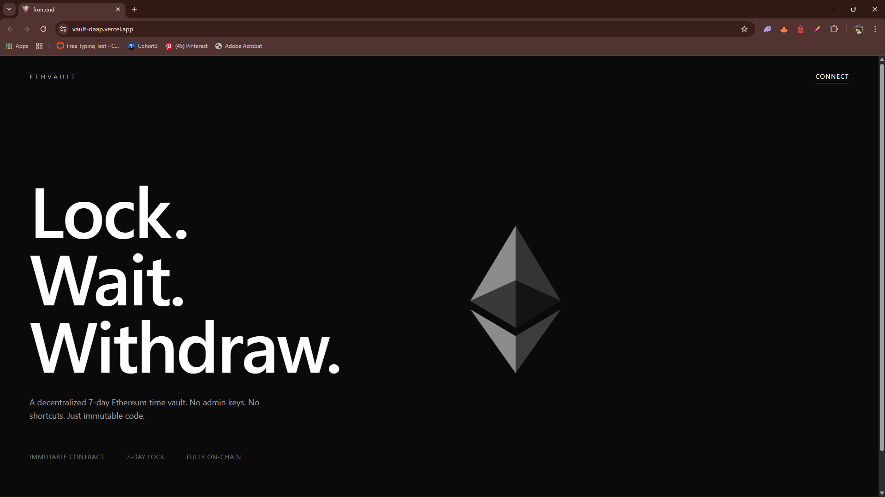
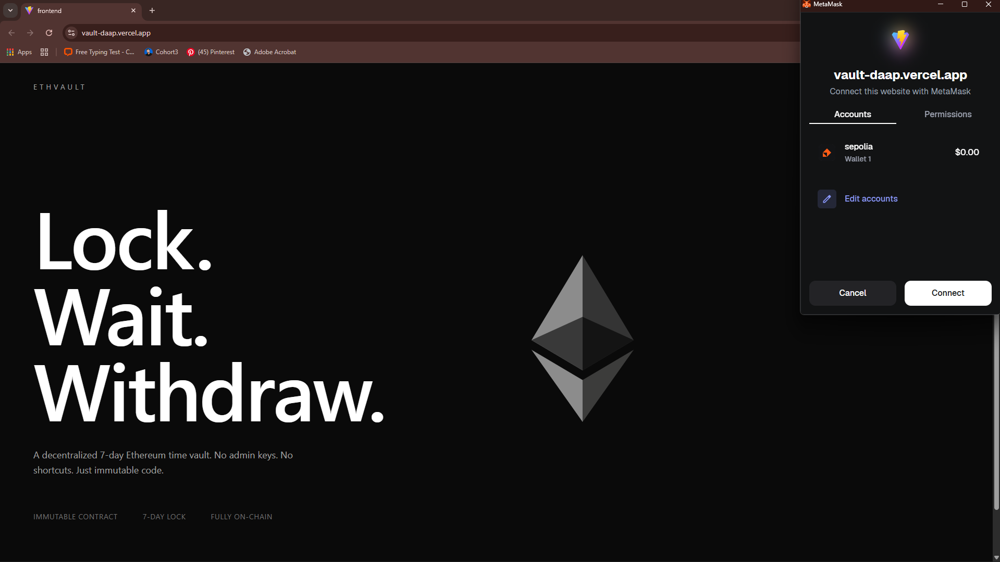
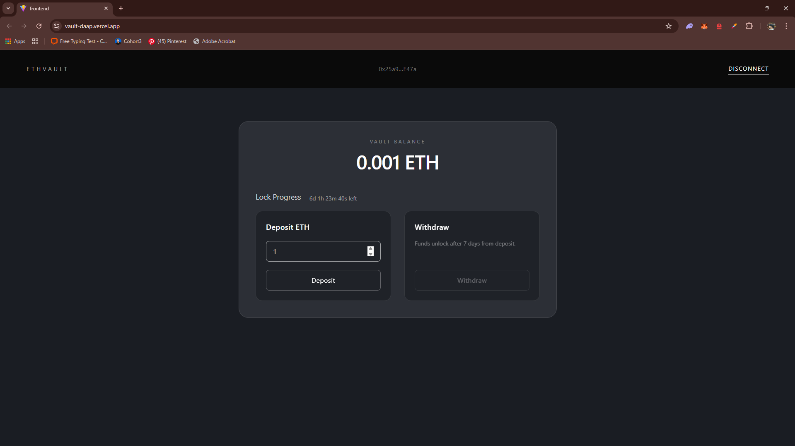

# 🏦 ETH Vault DApp

A decentralized Ethereum Vault application built on the **Sepolia Testnet** that allows users to securely deposit ETH, lock it for 7 days, and withdraw after the lock expires.

🌐 **Live Demo:** https://vault-daap.vercel.app  
🧪 **Network:** Sepolia Testnet  

---

## 📌 Project Overview

ETH Vault DApp is a full-stack Web3 application consisting of:

- 🔐 Smart Contract (Solidity + Hardhat)
- ⚡ Frontend (React + Wagmi + Viem)
- 🌍 Deployed on Sepolia Testnet
- 🚀 Frontend hosted on Vercel

### Users Can:
- Connect wallet (MetaMask)
- Deposit ETH into vault
- Track lock countdown
- Withdraw after 7 days

---

## 🛠 Tech Stack

### 🔹 Smart Contract (Backend)
- Solidity
- Hardhat
- Ethers.js
- Sepolia Testnet

### 🔹 Frontend
- React + TypeScript
- Wagmi
- Viem
- TanStack React Query
- Tailwind CSS

---

## 📂 Project Structure

```
vault-daap/
├── backend/        # Smart contract (Hardhat project)
├── frontend/       # React + Wagmi application
├── screenshots/    # UI screenshots
└── README.md
```

## ⚙️ Environment Variables

Create a `.env` file in the root directory:

```
SEPOLIA_RPC_URL=your_rpc_url
PRIVATE_KEY=your_wallet_private_key
ETHERSCAN_API_KEY=your_etherscan_key
```

⚠️ Never commit your private key.

---

# 🔄 How It Works

1. User connects wallet (MetaMask)
2. Deposits ETH
3. Contract stores:
   - Deposit amount
   - Deposit timestamp
4. 7-day lock period starts
5. Withdraw enabled only after lock expires

---

# 📸 Screenshots





---

# 🚀 Deployment

### Frontend
Deployed on Vercel  
https://vault-daap.vercel.app

### Smart Contract
Deployed on Sepolia Testnet

---

# 🧠 Learning Highlights

- Smart contract time-lock logic
- Wagmi contract read/write hooks
- React state + blockchain synchronization
- Wallet connection management
- Async transaction handling

---

# 🔮 Future Improvements

- Multiple deposits support
- Interest calculation
- Transaction history
- Mainnet deployment
- Multi-user vault tracking

---

# 👤 Author

Salong Debbarma  
B.Tech CSE — NIT Agartala  

---
